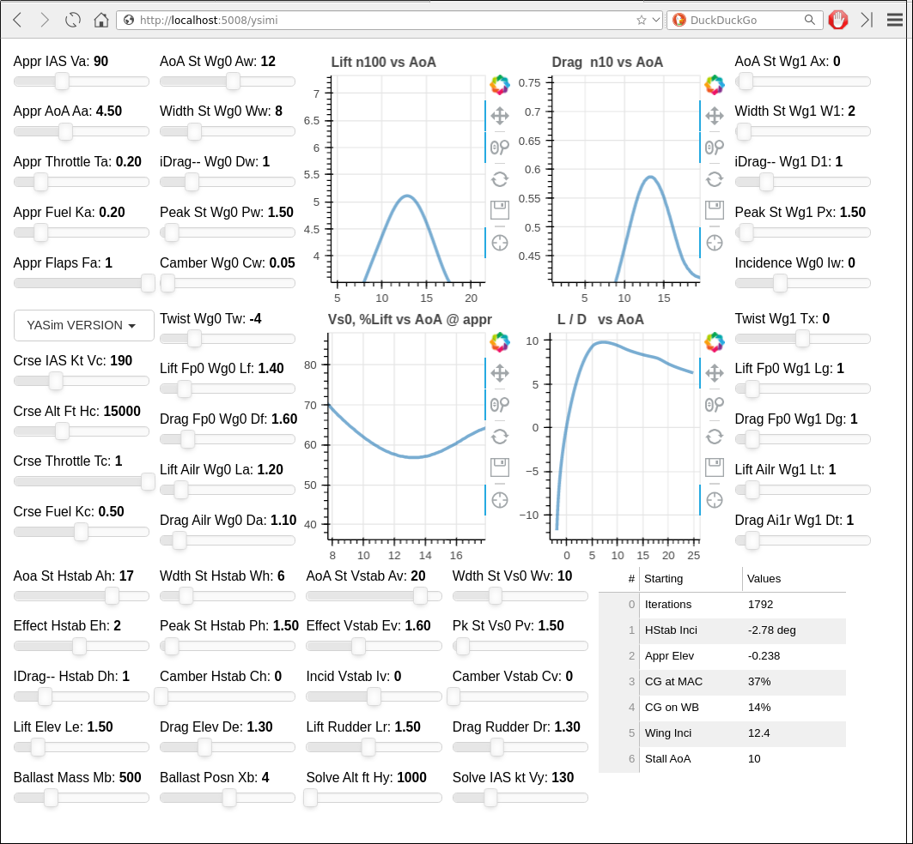

## YSIMI  Interactive Tuning Tools for FlightGear's YASIM Flight Dynamics Model

Yasim FDM uses a configuration file to create its FDM and can supply tabulated Lift, Drag Tables and a solution summary text. These python tools automatically
generate configuration files and plotting data while key elements of the configuration files may be adjusted on an interactive web interface.

YASim Simulator Interactive  ysimi.py is the app with latest list of YASim parameters.

## ysimi.py

ysimi.py uses python's bokeh package, it serves a live control / plotting interface shown on a web browser.  Key elements in a YASim configuration file may be altered by sliders in the web app while Lift / Drag curves are updated with live plots.

At the same time an updated YASim configuration file is re-written so that a FlightGear session  may instantly reload with updated configuration ready for testing.

### Installation

#### Pip-able systems

ysimi.py is a python script, it gets served as a web page by the bokeh package. After python 3 is properly installed on your system check if the pip package manager is installed and then check for and, if needed, have pip install bokeh, pandas

**For linux (Fedora)**

After  python3 is installed then follow the bokeh guide to installation. Use pip to install bokeh, pandas,.. if needed: install other packages, see beginning of ysimi.py    

#### Windows

For Windows, here are some great guides.
When you install python be sure to check the button to add python onto the system path

  * [how-to-install-python-on-windows](https://www.liquidweb.com/kb/how-to-install-python-on-windows/) -  Python needed to be installed after FlightGear ( to keep paths intact )
  * [install-pip-windows](https://www.liquidweb.com/kb/install-pip-windows/) - if you need pip
  * [Get pip](https://bootstrap.pypa.io/get-pip.py)

The guides show you how to check if each is installed.

### Usage

It needs a copy of the FlightGear model's YASim configuration named [dddd]-yasim-inpt.xml.  [dddd] is the current working directory, for example user/moi/[ysimi]
It is started by running in a command window:

    bokeh serve ysimi.py

The command then displays on a web browser at URL:  http://localhost:5006/ysimi
On the browser Lift, Drag, MIas plots are updated live with slider input. The console are updated key YASim solution results that affect the model's motion.     

An example workflow details are commented at the start of file: ysimi.py

[Buckaroo's Yasim Reference](https://buckarooshangar.com/flightgear/yasimtut.html)

#### Running Real-Time Plots

Make a working directory with a short name denoting the model

    cd user/moi
    mkdir myModel; chdir myModel
    copy ysimi.py into this working folder
    copy / create a base configuration file from the YASim configuration file(s) of interest :
    cp /pathTo/fgaddon/Aircraft/theModel/model-yasim.xml  myModel-yasim-inpt.xml

start the server:

  pathToEnv/bokeh serve ysimi.py

The standard bokeh port is 5006. It is noted in command line output. Open a web browser at following URL and in a new tab http://localhost:5006/ysimi

To see the effect on Lift and Drag curves slowly adjust any pointer. Each step will trigger a yasim re-run and re-plot of the three curves while on the console a brief message
reports key results: Elevator on Approach  and  Center of Gravity relative to Wing's MAC.

A new YASim configuration is created as adjustments are made at the browser,  the new file is named: [dirName]-yasim-outp.xml.   

## inciMarg.py

A command line logout of Wing Incidence, derived from wheel/centerline geometry, compared to wing stall AoA values read from a named YASim configuration file:

> inciMarg.py -f t6/t6-yasim.xml
 t6-yasim.xml   CL incidence: 11.294  Wing incidence: 2.000  Total Incidence : 13.294    Wing AoaStall: 15.000   % Margin: 11.374
